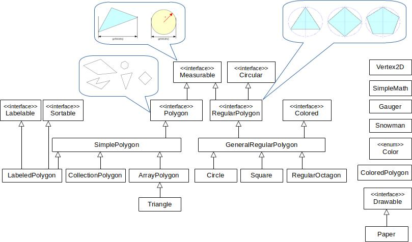

## Ninth iteration

Exercise focused on working with ordered collections (and lambda expressions).

In previous iterations, we created several variants of simple n-gons, whose topology (the order of interconnection of vertices by edges) was given by the order of vertices.
Now let's create an n-gon with named vertices.
The topology will be given by the alphabetical order of the names of the vertices.
By changing the names of the vertices, we can easily change the topology of the n-gon.

Let's look at an example. In the following image, the left is an n-gon with six vertices.
The numbers at the vertices represent the order in which the vertices were defined and the topology is given by their order.
If the topology is given by naming the vertices, then the same result is achieved by naming vertices 1-6 with the letters A-F (picture in the middle).
However, renaming vertices can completely change the topology without having to change the order of the n-gon vertices themselves (picture on the right).


1.  Define the natural order on the `Vertex2D` class according to the `equals() `method,
    i.e. it is sorted according to the X coordinate in ascending order and in case of a match it is sorted by Y in ascending order.
	> For primitive types, there are static comparison methods, such as `Double.compare`.

2.  Create `VertexInverseComparator` for the `Vertex2D` class in the package `cz.muni.fi.pb162.project.comparator`.
    The comparator will sort the vertices by **descending**, first sort by X coordinate descending, and in case of a match, sort Y by descending.

3.  Use a **sorted map** to create a `LabeledPolygon` class extending the `SimplePolygon` class.
    This class will be similar to the `ArrayPolygon` and `CollectionPolygon` classes, except that the vertices are stored under their names.

    The vertices are named by any text string (usually one letter) and *the name of the vertex is unique within the n-gon*.
    However, an n-gon can contain two differently named vertices with the same coordinates
    (see the situation in the example above).

    The order of vertices in an n-gon is given by their naming (lexicographically ascending).

    The class will have a **private** constructor with one parameter - a map of vertices and their labels.
	
    The class will not be inheritable (will be final).

    Implement the following interfaces (for more information, see the JavaDoc of the interface).

    Methods from the `Polygon` interface:
    *   `Vertex2D getVertex(int index)` returns the index-th vertex with respect to the order given by the vertex naming.
        For example, if we have vertices "A", "B" and "C", then the zero vertex is "A",
        the first vertex "B", the second vertex "C", the third vertex again "A" (modulo) etc.
    *   `int getNumVertices()` returns the number of vertices in the collection.

    Implement the `Labelable` interface:
    *   `Vertex2D getVertex(String label)` returns the coordinates of the vertex named `label`.
        Method throws `IllegalArgumentException` if such vertex does not exist.
    *   `getLabels()` returns a collection of vertex names arranged lexicographically **ascending**.
    *   `getLabels(Vertex2D vertex)` returns all vertex names with `vertex` coordinates.
        If no such vertex exists, it returns an empty collection.

    Implement the `Sortable` interface:
    *   `Collection<Vertex2D> getSortedVertices()` returns vertices sorted by natural order without duplication.
    *   `Collection<Vertex2D> getSortedVertices(Comparator<Vertex2D> comparator)` takes any 2D vertex comparator and returns vertices sorted by that comparator without duplication.

    Finally, the `Collection<Vertex2D> duplicateVertices()` method returns a set of vertices that are stored multiple times under different names in the polygon.

4. Create a **nested** utility class `Builder`, i.e., `LabeledPolygon.Builder`.
   This class will take care of creating the polygon.
   *   The class will implement the `Buildable` interface.
   *   The `Builder addVertex(String label, Vertex2D vert)` method saves the vertex under the given name.
       The name or the vertex cannot be `null`, otherwise the method will fail with a suitable exception.
       If a vertex already exists in the n-gon under the given name, it will be replaced by a new one.
   *   The `LabeledPolygon build()` method returns a new `LabeledPolygon` instance filled with vertices.
   *   Usage:
       ```java
       LabeledPolygon polygon = new LabeledPolygon.Builder()
            .addVertex("A", new Vertex2D(2, 5))
            .addVertex("B", new Vertex2D(3, 1))
            .addVertex("C", new Vertex2D(1, 3))
            .build();
       ```

5.  If you performed the implementation without errors, then after running the `Draw` class, a [polygon with named vertices will be drawn on the screen](https://gitlab.fi.muni.cz/pb162/pb162-course-info/wikis/draw-images)
    similar to the middle polygon above.

### Hints


### Target UML class diagram:


